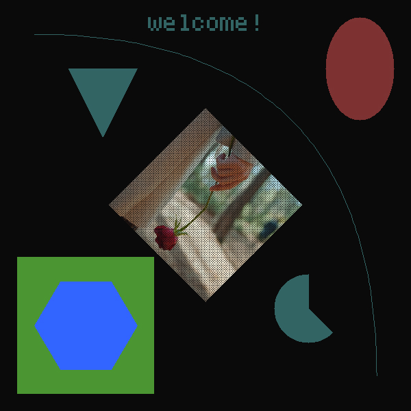

# Replot

### 0. Description

> a canvas library for c to draw shapes on images, you can save the canvas to and image or draw to a buffer with custom plot func.

### 1. Usage

> drawing some rect and save as an image

```c
// create a canvas
Replot *rplt = Replot_new(600, 600);
// print ascii text
Replot_printText(rplt, RPOINT(300, 100), 10, "WELCOME!");
// fill with stencil
Replot_setImage(rplt, "test.png");
Replot_fillRect(rplt, RPOINT(300, 400), RSIZE(200, 200)); 
// save as image
Replot_write(rplt, "test.jpg");
```

> for more info please visit `replot.c` file



### 2. Alternatives

- [RSoft: software rendering library oriented around math.](https://github.com/ColleagueRiley/rsoft)

- [Silk: Single-Header CPU graphics library](https://github.com/itsYakub/Silk/)

- [Olive: Simple 2D Graphics Library for C](https://github.com/tsoding/olive.c)
